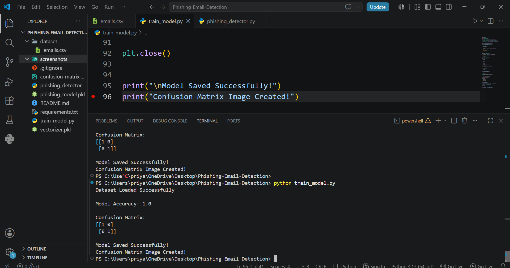
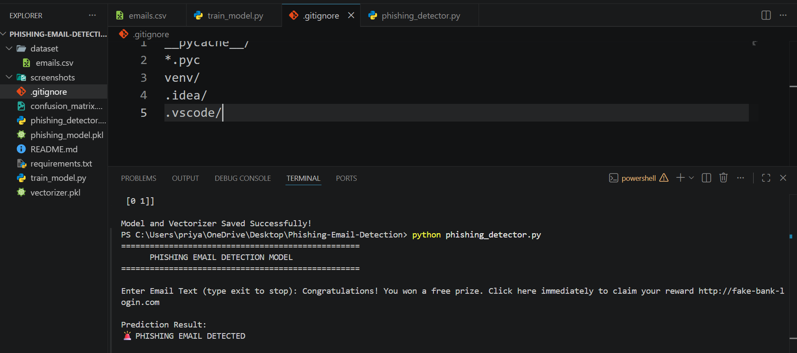
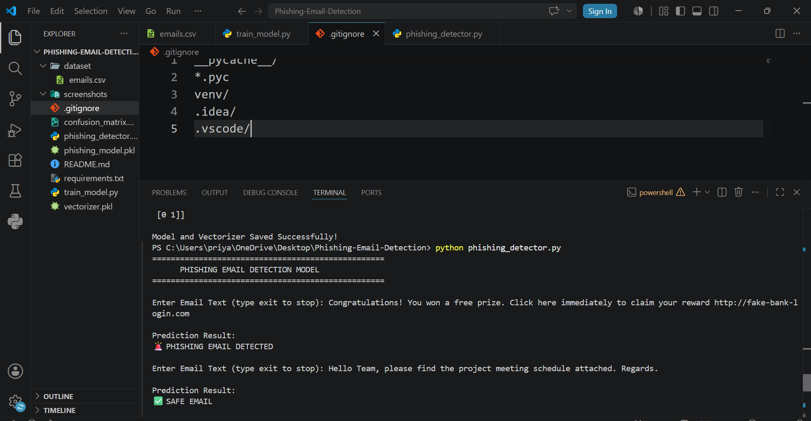
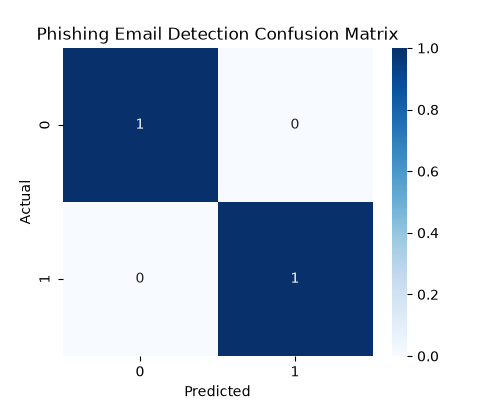

# 📧 Phishing Email Detection Model

A **Machine Learning based Phishing Email Detection System** that classifies emails as **Phishing** or **Safe** using Natural Language Processing (NLP) and Scikit-learn.

The model analyzes email text, extracts important features using **TF-IDF Vectorization**, and uses a **Logistic Regression classifier** to detect suspicious emails.

This project was developed as part of the **Thiranex Cyber Security Internship**.

---

## 🚀 Features

* 📧 Detect phishing and legitimate emails
* 🤖 Machine Learning classification model
* 📝 Text feature extraction using TF-IDF
* 📊 Model accuracy evaluation
* 📈 Confusion matrix visualization
* 🔍 Predict custom email content
* 💾 Save trained ML model
* 💻 Simple command-line interface

---

## 🛠️ Technologies Used

* Python 3
* Pandas
* Scikit-learn
* Matplotlib
* Seaborn
* Joblib
* Natural Language Processing (NLP)

---

## 📂 Project Structure

```text
Phishing-Email-Detection/
│
├── dataset/
│   └── emails.csv
│
├── screenshots/
│   ├── training_output.png
│   ├── phishing_prediction.png
│   ├── safe_prediction.png
│   └── confusion_matrix.png
│
├── phishing_model.pkl
├── vectorizer.pkl
├── train_model.py
├── phishing_detector.py
├── requirements.txt
├── README.md
├── LICENSE
└── .gitignore
```

---

## ⚙️ Installation

### Clone Repository

```bash
git clone https://github.com/sonu-balagavi15/Thiranex-Phishing-Email-Detection.git
```

### Navigate to Project

```bash
cd Thiranex-Phishing-Email-Detection
```

### Install Dependencies

```bash
pip install -r requirements.txt
```

---

## ▶️ Training the Model

Run:

```bash
python train_model.py
```

The script will:

* Load the email dataset
* Convert text into numerical features
* Train the machine learning model
* Evaluate accuracy
* Generate confusion matrix
* Save trained model files

Generated files:

```text
phishing_model.pkl
vectorizer.pkl
confusion_matrix.png
```

---

## 🔍 Email Prediction

Run:

```bash
python phishing_detector.py
```

Enter an email message.

Example:

### Phishing Email

```
Congratulations! You won a free prize.
Click here immediately to claim your reward.
http://fake-link.com
```

Output:

```
🚨 PHISHING EMAIL DETECTED
```

---

### Safe Email

Input:

```
Hello Team,
Please find the project meeting report attached.
Regards.
```

Output:

```
✅ SAFE EMAIL
```

---

## 📊 Machine Learning Workflow

```
Email Dataset
       |
       ↓
Text Preprocessing
       |
       ↓
TF-IDF Feature Extraction
       |
       ↓
Logistic Regression Model
       |
       ↓
Prediction
       |
       ↓
Phishing / Safe Classification
```

---

## 📈 Model Evaluation

The project evaluates performance using:

### Accuracy Score

Measures how correctly the model classifies emails.

### Confusion Matrix

Shows:

* Correct phishing predictions
* Correct safe email predictions
* Incorrect classifications

---

## 📸 Screenshots

### Model Training Output



---

### Phishing Email Detection



---

### Safe Email Detection



---

### Confusion Matrix



---

## 🎯 Future Enhancements

* Larger real-world email dataset
* Deep Learning based detection
* URL reputation checking
* Attachment analysis
* Real-time email scanning
* Web-based dashboard
* Browser extension integration

---

## 📚 Learning Outcomes

This project helped in understanding:

* Machine Learning classification
* Natural Language Processing
* Feature extraction using TF-IDF
* Email security concepts
* Phishing detection techniques
* Model evaluation methods

---

## 👨‍💻 Author

**Sonu Parashuram Balagavi**

GitHub:
https://github.com/sonu-balagavi15

---

## 📄 License

This project is licensed under the MIT License.

---

## ⚠️ Disclaimer

This project is developed for **educational purposes only**. It demonstrates phishing detection concepts and should not be used as a replacement for professional email security solutions.

---

⭐ If you found this project useful, consider giving it a Star on GitHub.
